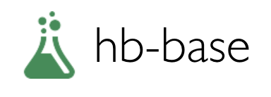

<p align="center">
  
</p>

<p align="center">

  <a href="https://github.com/hb-research/hb-base">
    
  </a>
  
  <a href="https://github.com/hb-research/hb-base">
    
  </a>

</p>

# hb-base: project structure of Deep Learning experiments


hb-base proposes the structure of a deep learning project. Using TensorFlow's higher api a basic structure is provided. If you start a deep learning project from this project, All you need to do is implement the core.

## Why?

- There are many boilerplate codes when creating a new deep learning project.
- Recommend using **higher APIs** ([Estimator](https://www.tensorflow.org/api_docs/python/tf/estimator/Estimator), [Experiment](https://www.tensorflow.org/api_docs/python/tf/contrib/learn/Experiment), [Dataset](https://www.tensorflow.org/api_docs/python/tf/data/Dataset) and [tf.metrics](https://www.tensorflow.org/api_docs/python/tf/metrics))
- You can **focus the core** (model's graph).
- The training or evaluate results are automatically applied to the **TensorBoard**.
- When terminated learning, you can receive a notificatio with a Slack.

## Requirements

- Python 3.6
- TensorFlow 1.4
- [hb-config](https://github.com/hb-research/hb-config) (Singleton Config)
- requests
- [Slack Incoming Webhook URL](https://my.slack.com/services/new/incoming-webhook/)

## Project Structure

    .
    ├── config/                 # Config files (.yml, .json) using with hb-config
    ├── data/                   # dataset path
    ├── notebooks/              # Prototyping with numpy or tf.interactivesession
    ├── scripts/                # download dataset using shell scripts
    ├── concrete_model/         # concrete model architecture graphs (from input to logits)
        ├── __init__.py             # Graph logic
        ├── ...                     # Implements the components or modules
    ├── data_loader.py          # data_reader, preprocessing, make_batch
    ├── hook.py                 # training or test hook feature (eg. print_variables, handle training config)
    ├── main.py                 # define experiment_fn (enable tfdbg)
    ├── model.py                # define EstimatorSpec      
    └── utils.py                # slack notification (incoming-webhook)

Reference : [hb-config](https://github.com/hb-research/hb-config), [Dataset](https://www.tensorflow.org/api_docs/python/tf/data/Dataset#from_generator), [experiments_fn](https://www.tensorflow.org/api_docs/python/tf/contrib/learn/Experiment), [EstimatorSpec](https://www.tensorflow.org/api_docs/python/tf/estimator/EstimatorSpec), [tfdbg](https://www.tensorflow.org/programmers_guide/debugger)

Directories below contain dummy data.

- config/
- data/
- notebooks/
- scripts/

## Experiments mode

- `evaluate` : Evaluate on the evaluation data.
- `extend_train_hooks` :  Extends the hooks for training.
- `reset_export_strategies` : Resets the export strategies with the new_export_strategies.
- `run_std_server` : Starts a TensorFlow server and joins the serving thread.
- `test` : Tests training, evaluating and exporting the estimator for a single step.
- `train` : Fit the estimator using the training data.
- `train_and_evaluate` : Interleaves training and evaluation.


## Usage Example

> Download as zip then implements concrete model's graph, data_loader and  customizing others.

After implements.. Install requirements.

```pip install -r requirements.txt```

Then, Download dataset and pre-processing.

```
sh scripts/download_dataset.sh
python data_loader.py --config check-tiny
```

Finally, start train and evaluate model

```python main.py --config check-tiny --mode train_and_evaluate```

### Tensorboar

```tensorboard --logdir logs```


---

## Author

`Maintainer` [Dongjun Lee](https://github.com/DongjunLee) (humanbrain.djlee@gmail.com)
